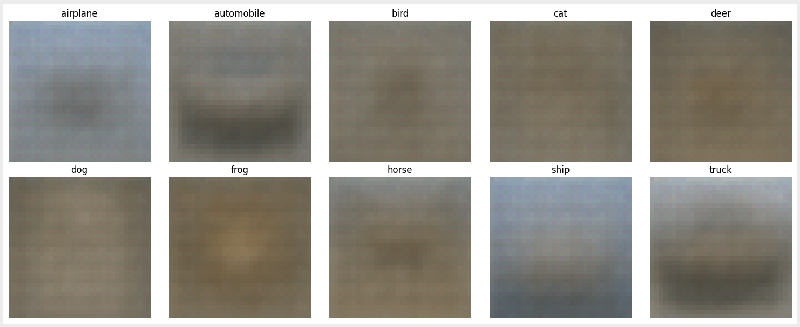
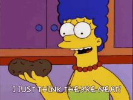

## Deep learning

I aim to sufficiently comment all code in this repository and provide summary / annotated notes.

This is for the 2024 S2 paper. Presumably copying these solutions is simply going to fail / raise a red flag in the case that changes are made by the uni. 

Grading / completeness update:

  Code is 100% functional, noted that there's some redundancy in the np calls in backprop. 

Turns out that exporting onenote to pdf arrives at a filesize of 800mb. I've just popped some 4k screenshots into notes. Messy? scatterbrained? Yes!

### What's this?

If you squint really hard, you can see the labels in the images. The code in ass 3 generates a decoder and encoder... the below is the average horse (etc) from the decoder.

In some ways, this is the world's most average horse.

*I realised that I implemented relu, not leaky relu, and making the changes has issues downstream on ass3. I don't think the network is deep enough that we would run into vanishing grad and I don't particularly think we'll be too penalized by the zero issue in terms of overall performance of the network on the dataset*

*Also misread the loss func, the photos above don't reflect what we should see (we should see more defined features) but that's okay*

### Test info?

Check notes (made pre-test, for obvious reasons. Probably worth poking around the keras / tf website beforehand)
